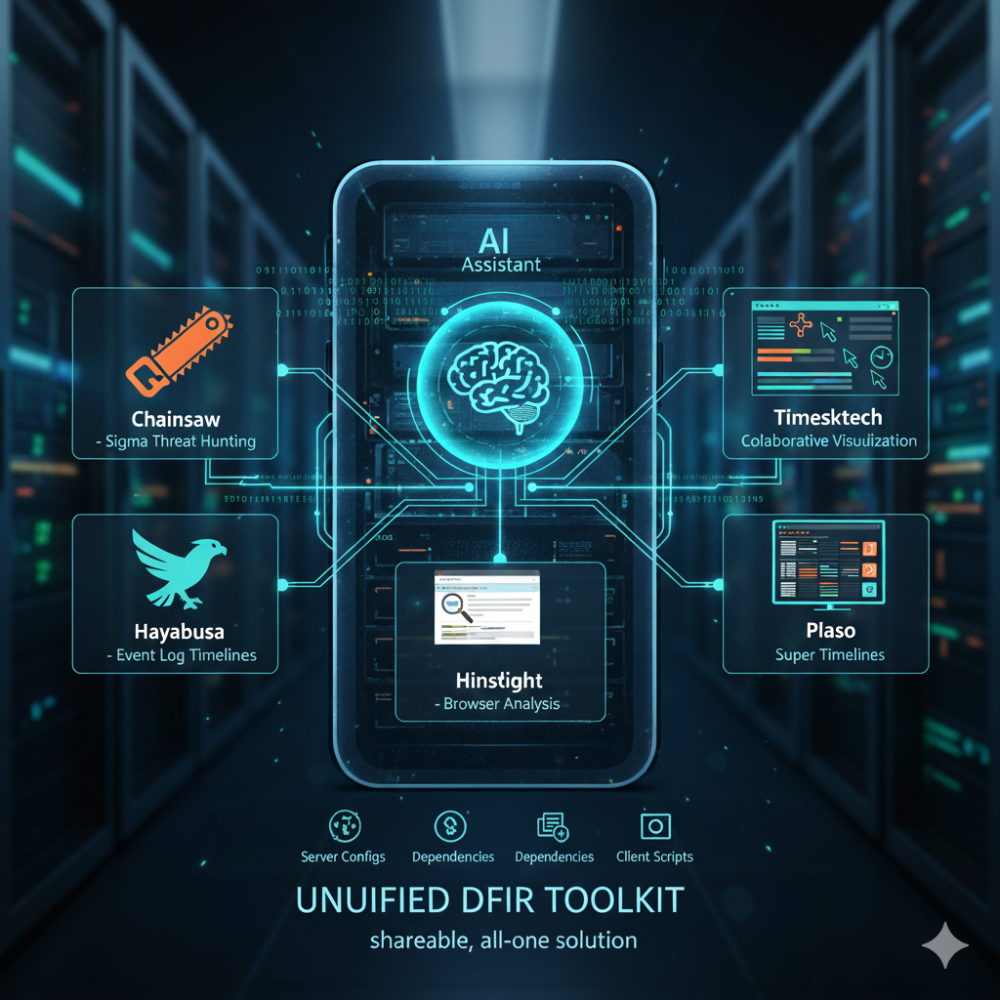

# Unified Forensic Analysis MCP Toolkit



## 1. Overview

This project provides a powerful, unified toolkit for digital forensics and incident response (DFIR). It integrates several industry-standard open-source tools—**Chainsaw, Hayabusa, Hindsight, Plaso, and Timesketch**—into a cohesive system powered by the Model Context Protocol (MCP). This allows a single AI assistant to orchestrate complex analysis workflows across multiple tools, streamlining investigations and correlating data from different sources.

This repository is designed to be a shareable, all-in-one solution for a DFIR team. It includes all necessary server configurations, dependencies, and client scripts to get up and running quickly.

### Included Tools

*   **[Chainsaw](https://github.com/WithSecureLabs/chainsaw)** For hunting threats in event logs using Sigma rules.
*   **[Hayabusa](https://github.com/Yamato-Security/hayabusa)** For fast and efficient Windows Event Log timeline generation and analysis.
*   **[Hindsight](https://github.com/obsidianforensics/hindsight)** For deep analysis of web browser history.
*   **[Plaso](https://github.com/log2timeline/plaso)** For creating super timelines from a vast array of forensic artifacts.
*   **[Timesketch](https://github.com/google/timesketch)** For collaborative timeline analysis and visualization.

## 2. Initial Project Setup

Follow these steps to set up the project for the first time.

### Step 2.1: Create Virtual Environment

It is highly recommended to use a dedicated Python virtual environment. This project has been tested and stabilized with Python 3.13.

```bash
# Navigate to the project root directory
cd /Users/username/Desktop/Code/MCPs

# Create a new virtual environment
python3 -m venv venv
```

### Step 2.2: Activate Environment and Install Dependencies

Activate the new environment and install all required packages from the `requirements.txt` file.

```bash
# Activate the virtual environment
source venv/bin/activate

# Install all dependencies
pip install -r requirements.txt
```

### Step 2.3: Start the Timesketch Backend

Timesketch requires two background processes to be running: the Celery worker and the web server.

**Terminal 1 - Start the Celery Worker:**
```bash
# Make sure your venv is active
source venv/bin/activate

# Navigate to the Timesketch server directory
cd servers/Timesketch

# Start the worker
celery -A timesketch.lib.tasks worker --loglevel=info
```

**Terminal 2 - Start the Timesketch Web Server:**
```bash
# Make sure your venv is active
source venv/bin/activate

# Navigate to the Timesketch server directory
cd servers/Timesketch

# Start the web server
python start_server.py
```

Once these are running, you can proceed to use the MCP servers.

## 3. How to Use the MCP Servers

All MCP servers are defined in `mcp_config.json` and can be called by a compatible MCP client (like the Windsurf IDE extension). The following sections provide natural language prompts to use each server's tools.

### 3.1 Chainsaw Server

Provides threat hunting capabilities for event logs using Sigma rules.

*   **Run a Sigma Scan (`run_chainsaw_scan`):**
    > "Run a Chainsaw scan on the directory `/path/to/evtx/logs`."

*   **Run a Scan with a Higher Threshold:**
    > "Run a Chainsaw scan on `/path/to/evtx/logs` with a detection level of 'critical'."

*   **Search Logs with a Pattern (`search_chainsaw_logs`):**
    > "Search the logs in `/path/to/evtx/logs` for the pattern 'powershell.exe'."

*   **Search Logs with a Regex:**
    > "Search the logs in `/path/to/evtx/logs` with the regex `.*mimikatz.*`."

*   **Dump an Artifact File (`dump_artifact`):**
    > "Dump the artifact file `/path/to/some.evtx` in JSON format."

*   **List Available Sigma Rules (`list_sigma_rules`):**
    > "List the available Sigma rule sets for Chainsaw."

### 3.2 Hayabusa Server

Analyzes Windows Event Logs (`.evtx`) to create timelines and metrics.

*   **Create a CSV Timeline (`csv_timeline`):**
    > "With Hayabusa, create a CSV timeline from the event logs in `/path/to/evtx/logs` and save it to `/path/to/hayabusa_timeline.csv`."

*   **Create a JSON Timeline (`json_timeline`):**
    > "Use Hayabusa to generate a JSON timeline from the logs at `/path/to/evtx/logs`."

*   **Get Event ID Metrics (`eid_metrics`):**
    > "Get the Event ID metrics from the logs in `/path/to/evtx/logs` using Hayabusa."

*   **Get Computer Metrics (`computer_metrics`):**
    > "Using Hayabusa, get the computer metrics for the logs at `/path/to/evtx/logs`."

*   **Check Hayabusa Version (`hayabusa_version`):**
    > "What version of Hayabusa is installed?"

### 3.3 Hindsight Server

Analyzes web browser history and artifacts.

*   **Analyze Browser History File (`analyze_browser_history`):**
    > "Use the Hindsight server to analyze the Chrome history file at `/path/to/History`."

*   **Analyze a Full Browser Profile (`analyze_chrome_profile`):**
    > "Perform a full analysis of the Chrome profile located at `/path/to/chrome/Default`."

*   **List Completed Analyses (`list_analyses`):**
    > "List all completed Hindsight analyses."

*   **Get Analysis Summary (`get_analysis_summary`):**
    > "Get the summary for Hindsight analysis 'history_1'."

*   **Search Analysis Results (`search_analysis_results`):**
    > "In Hindsight analysis 'history_1', search for the term 'malicious.com'."

### 3.4 Plaso Server

Creates super timelines from various forensic artifacts.

*   **Create a Plaso Storage File (`create_timeline`):**
    > "Using the Plaso server, create a storage file at `/path/to/output.plaso` from the source evidence at `/path/to/evidence.E01`."

*   **Export a Timeline from a Plaso File (`export_timeline`):**
    > "With the Plaso server, export a CSV timeline from the storage file `/path/to/output.plaso` and save it to `/path/to/exported_timeline.csv`."

*   **Export a Filtered Timeline:**
    > "Using the Plaso server, export a timeline from `/path/to/output.plaso` to `/path/to/filtered_timeline.csv`, but only include events where the date is after '2025-01-01'."

### 3.5 Timesketch Server

Handles interaction with the Timesketch timeline analysis platform.

*   **List Existing Sketches (`list_sketches`):**
    > "List all my sketches in Timesketch."

*   **Create a New Sketch (`create_sketch`):**
    > "Create a new Timesketch sketch named 'My New Investigation'."

*   **Upload a Timeline (`upload_timeline`):**
    > "Upload the file `/path/to/my_timeline.csv` to sketch 'My New Investigation' and name the timeline 'CSV Timeline'."

## 4. Example End-to-End Workflow

This workflow demonstrates how to combine the servers to analyze Windows Event Logs and Chrome browser history, then aggregate both timelines into a single Timesketch sketch for analysis.

**Prompt:**
> "I want to perform a full forensic analysis. First, create a new Timesketch sketch named 'Suspicious Activity Investigation'. Next, use Hayabusa to create a timeline from the event logs at `/path/to/logs`. Also, use Hindsight to analyze the Chrome history from `/path/to/History`. Finally, upload both the Hayabusa and Hindsight timelines to the new Timesketch sketch you created, naming them 'Hayabusa EVTX Timeline' and 'Hindsight Browser Timeline' respectively."

This single, powerful prompt will orchestrate the entire workflow, providing a unified view of the evidence for your investigation.

## 5. Project Structure

```
.
├── mcp_config.json       # Main configuration for all MCP servers
├── requirements.txt      # All Python dependencies for the project
├── README.md             # This file
└── servers/
    ├── Chainsaw/         # Chainsaw server and binaries
    ├── Hayabusa/         # Hayabusa server, client, and binaries
    ├── Hindsight/        # Hindsight server, client, and source code
    ├── Plaso/            # Plaso server, client, and source code
    └── Timesketch/       # Timesketch server, client, and startup scripts
```
